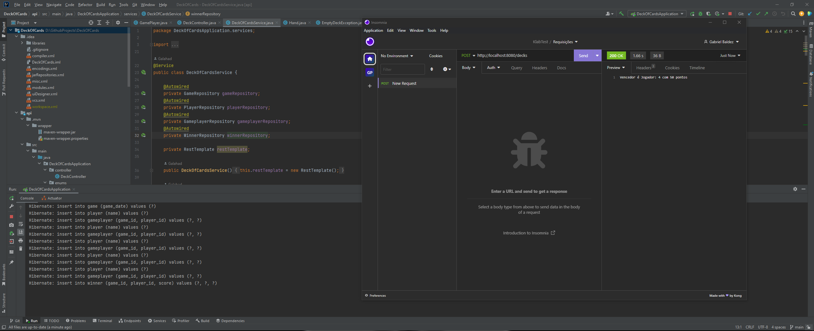
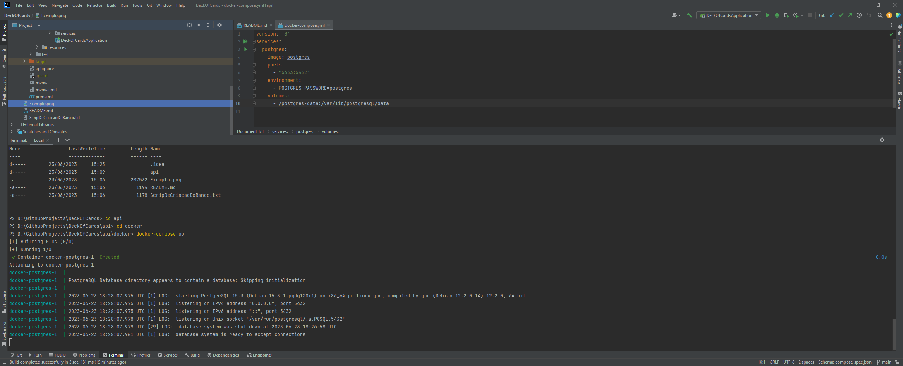

# Este projeto consiste na criação de uma REST API em conjunto com a API deckofcardsapi.

## Documentação da API

#### Retorna o vencedor do jogo com todos os dados já salvos no banco, caso tenha empate é mostrado os jogadores empatados
```http
  Post http://localhost:8080/decks
```
## Ferramentas Utilizadas

- Java 17
- Spring 3.0.5
- IntelliJ IDEA
- PostgreSQL
- Maven
- Git
- Insomnia
- JUnit
- JPA
- Lombok
- Docker

## Configuração do Ambiente

1. Certifique-se de ter o Java 17 instalado.
2. Instale o IntelliJ IDEA (ou outra IDE de sua preferência) e configure o projeto.
3. Importe o projeto para o IntelliJ IDEA.
4. No terminal da IDE, execute os seguintes comandos para iniciar o banco de dados PostgreSQL usando Docker:
```
   cd api
```
```
   cd docker
```
```
 docker-compose up
```
6. As tabelas são criadas automaticamente após o primeiro start na aplicação.

## Como Utilizar

1. Faça uma requisição POST para o endpoint `http://localhost:8080/decks` usando Insomnia ou Postman.
2. Aguarde a resposta da API, que retornará o vencedor do jogo com todos os dados já salvos no banco.

## Exemplo de atulização

## Exemplo de como usar o contêiner  

